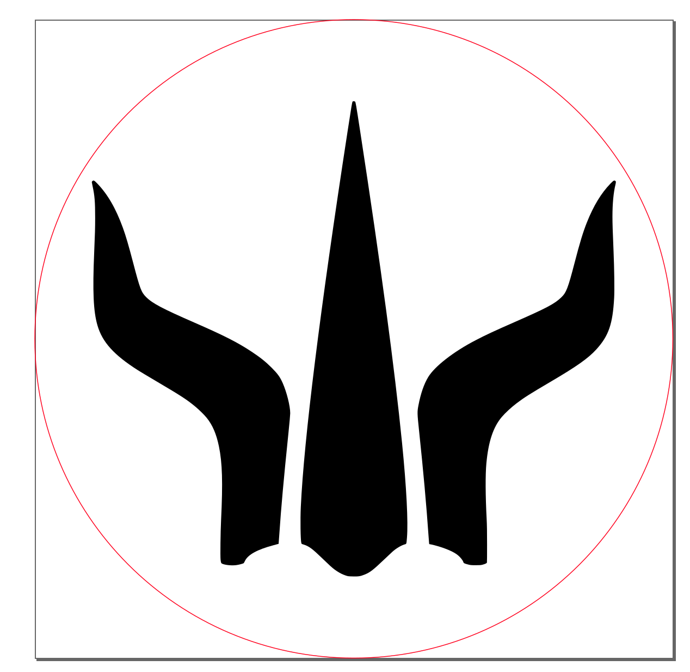

# Gloomhaven Character 3D printables

**Download the models on Printables:**
* [For Gloomhaven](https://www.printables.com/model/194645-gloomhaven-class-storage-boxes)
* [For Jaws of the Lion](https://www.printables.com/model/194665-jaws-of-the-lion-class-storage-boxes)
* [For Frosthaven](https://www.printables.com/model/194666-frosthaven-class-storage-boxes)
* [for Custom Classes](https://www.printables.com/model/198100-gloomhaven-custom-class-storage-boxes)

This is a collection of tools for generating some 3D models for 3D printing
organizers for gloomhaven. The code is set up so that you can generate the items
with any of the various gloomhaven class icons (or really, any arbitrary SVG.)

## Dependencies

In order to run this code, you need the following installed on your computer:

* [OpenSCAD](https://www.openscad.org/)
* GNU Make (Optional, should be installed by default on Linux, try
  [here](http://gnuwin32.sourceforge.net/packages/make.htm) for windows.)

## Building

To build all of the official classes (Gloomhaven, Forgotten Circles, Jaws of the
Lion), just open a terminal in this directory and run `make`. To make those
classes plus all of the custom classes, run `make all`.

You can also run `make {target}` to build a different set of classes, eg:

* `make GH` makes Gloomhaven classes
* `make FC` makes just the diviner
* `make JOTL` makes the Jaws of the Lion classes
* `make custom` makes all of the custom classes
* Run with a class name (`make 01_Brute`, `make C_Artificer`) to make just that
  class.

## Building without make

You can build all of the scad files just using openscad. For the most part,
parameters that can be tweaked are at the top of the files. Each model that uses
the character icons has a variable called `icon_file` that you can change to
different values for the different classes. You can do this manually, or at the
command line by running (for example):

```
openscad source/scad/characterbox_icon.scad -D icon_file="\"../../icons/02_Tinkerer.svg\"" -o tinkerer_icon.stl
```

Note that the paths for `icon_file` are always relative to the scad file.

## Adding more classes/Using your own Icons

To generate all the files for another class, you need to add an svg file with
the class's icon to the `resources/icons` folder. The svg file needs to be the
right size: the icon should be centered on a 100mmx100mm canvas. It's useful to
add a 100mm diameter circle to help see what it will look like on the circular
pieces:



*just be sure to delete the circle before using the file*, or openscad will
import the circle on top of the icon. [Inkscape](https://inkscape.org/) is
useful for editing svg files.

You can build a class with an icon like this using OpenSCAD with the steps
above. To make the class available to build with `make`, add it to one of the
classes lists (`classes_gh`, `classes_custom`, etc.) in `Makefile`.

## Spoilers

There's a bit more in this repo that's been obfusticated because it spoils some
in-game secrets. If you know what you're looking for, check the readme in the
`spoilers` directory.
